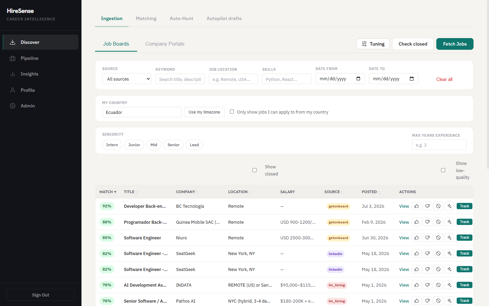
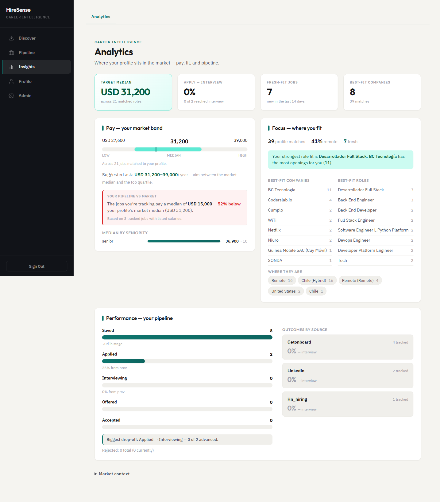
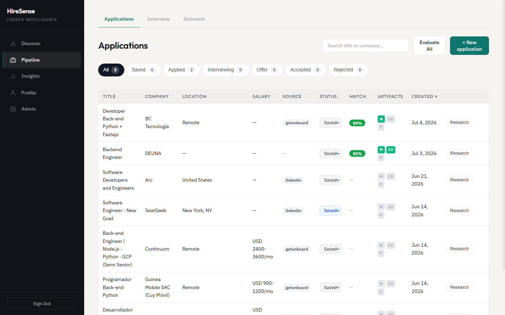

<div align="center">


### From the job-board firehose to your next interview — self-hosted, end to end.

HireSense pulls postings from job boards and company ATS portals, ranks them against your
profile with **pgvector semantic search + tiered LLM scoring**, and runs the whole pipeline
on your own infrastructure: tracking, CV & cover-letter generation, interview prep,
outreach, and analytics.

[](https://www.python.org/)
[](https://fastapi.tiangolo.com/)
[](https://angular.dev/)
[](https://github.com/pgvector/pgvector)
[](LICENSE)
[](#-contributing)

**[Live Demo](https://hiresense-demo.vercel.app) · [Quick Start](#-quick-start) · [How it works](#-how-it-works) · [Architecture](#-architecture) · [Screenshots](#-screenshots)**

**[Try the frontend-only demo →](https://hiresense-demo.vercel.app)** — Read-only,
synthetic data, no account required, and no backend connected.

</div>

<div align="center">
  
</div>

---

## What is HireSense?

**The problem.** Job hunting is a search problem drowning in noise: the same roles reposted
across a dozen boards, listings that don't match your stack, a CV you rewrite from scratch
for every application, applications you lose track of, and no signal on where you actually
stand in the market.

**What HireSense does.** It turns that firehose into a ranked, deduplicated shortlist —
pre-ranking the entire corpus with pgvector ANN so the best matches reach page one, refining
with skill overlap and tiered LLM scoring — then helps you act on the results, end to end.

| The pain | How HireSense solves it |
|---|---|
| The same roles reposted across a dozen boards | Ingests many sources and **deduplicates by stable identity** — one canonical entry per role. |
| Listings that don't match your stack | **Whole-corpus semantic pre-ranking** + skill overlap + tiered LLM scoring put real fits on page one. |
| Rewriting your CV and cover letter for every role | **Tailored CV & cover-letter generation** from templates, per posting. |
| Losing track of where each application stands | **Pipeline tracking** — Saved → Applied → Interviewing → Offer, with per-application artifacts. |
| No signal on your market position | **Market analytics** — your pay band, best-fit companies & roles, and pipeline conversion. |
| Dead listings cluttering the results | **Change & closure detection** updates jobs in place and hides ones that disappear or 404. |
| The hunt stalls the moment you get busy | **Autopilot** — scheduled hunts, notifications, and inbound-email → tracking keep it moving. |

## 🎯 Why HireSense?

- **From firehose to shortlist** — semantic pre-ranking runs over the *entire* corpus, not
  just the current page, so the strongest matches land on page one instead of being buried
  under reposts.
- **Own your data, self-hosted** — the full stack runs on your own infrastructure (Docker:
  Postgres, API, web, Grafana). No third-party SaaS holds your profile, your matches, or
  your applications.
- **Cost-aware by design** — tiered LLM scoring lets cheap models filter the long tail while
  stronger models rank the finalists, so quality stays high and spend tracks signal.
- **The whole hunt in one place** — discover, track, generate tailored CVs & cover letters,
  prep for interviews, and see where you stand on pay and fit — end to end, without stitching
  separate tools together.
- **Runs without an LLM key** — `APP_MODE=local` falls back to heuristic-only matching, so
  you can explore the full app before wiring up any external services.

## ✨ Features

- **Multi-source ingestion** — job boards (Remotive, RemoteOK, Jobicy, Himalayas,
  WeWorkRemotely, GetOnBoard, LinkedIn, HN "Who is hiring?", Arbeitnow, The Muse,
  Dice, CrunchBoard, Y Combinator Jobs; plus optional Adzuna and import fallbacks
  for Indeed / Wellfound / Glassdoor / Monster) and company ATS portals
  (Greenhouse, Lever, Ashby, Workable, SmartRecruiters, Recruitee), deduplicated
  by stable identity with cross-source provenance.
- **Semantic matching** — global pgvector ANN pre-ranking over the whole corpus, blended
  with skill overlap and **tiered LLM scoring** (cheap models filter, strong models rank).
- **Application pipeline** — track every role Saved → Applied → Interviewing → Offer, with
  per-application artifacts and research.
- **Document generation** — CVs and cover letters from templates, tailored to each posting.
- **Market analytics** — your pay band, best-fit companies and roles, and pipeline
  conversion, all derived from your matched jobs.
- **Autopilot** — scheduled hunts, notifications, and inbound-email → tracking, so the
  pipeline keeps moving without you babysitting it.
- **Change & closure detection** — jobs are updated in place on refetch and closed
  automatically when they disappear or 404 (see [How it works](#-how-it-works)).

## 📸 Screenshots

<table>
  <tr>
    <td width="50%" valign="top">
      <br/>
      <sub><b>Insights</b> — market pay band, best-fit companies & roles, and pipeline conversion.</sub>
    </td>
    <td width="50%" valign="top">
      <br/>
      <sub><b>Pipeline</b> — track applications by stage with match scores and generated artifacts.</sub>
    </td>
  </tr>
</table>

## 🚀 Quick Start

Choose the path that fits you:

| Best for | Command |
|---|---|
| **Trying it out** (everything in Docker) | `docker compose up --build` |
| **Backend development** | `cd backend && uv sync && uv run app` |
| **Frontend development** | `cd frontend && npm install && npm start` |

**Docker** brings up the full stack — `db` (Postgres + pgvector), `app` (FastAPI :8000),
`frontend` (Angular :4200), and Grafana (:3000). First, set up backend config:

```bash
cp backend/.env.example backend/.env    # fill in auth / LLM / database secrets
docker compose up --build
```

> **No LLM key?** HireSense runs in `APP_MODE=local` by default — with a blank `LLM_API_KEY`
> it falls back to heuristic-only matching and default dev credentials, so you can explore
> the app before wiring up any external services. See [Configuration](#configuration).

## 🧠 How it works

### Matching pipeline

```
posting corpus  ──►  pgvector ANN pre-rank  ──►  skill overlap  ──►  tiered LLM scoring  ──►  ranked shortlist
 (all sources)       (global, whole corpus)      (fast filter)       (cheap → strong)          (page 1 = best fit)
```

Semantic pre-ranking runs over the **entire** corpus (not just the current page), so the
strongest matches surface first. LLM scoring is tiered — inexpensive models filter the long
tail, stronger models rank the finalists — keeping cost proportional to signal.

### Job lifecycle

Jobs are upserted by a stable identity (`source` + `source_id`, else `sha256(url)`); a
content hash drives in-place updates on refetch. Closures are detected two ways:

- **Snapshot sources** (company ATS portals) — a job missing from N consecutive complete
  fetches is marked `closed`.
- **Feed / search sources** — a throttled URL-probe sweep closes listings that 404 or show
  a "no longer available" marker. The in-app scheduler runs the sweep when
  `SCHEDULER_ENABLED=true`; when disabled, operators can trigger
  `POST /ingestion/revalidate` manually or from an external cron.

Closed jobs are hidden by default and dropped from semantic search.

## 🧩 Tech stack

| Layer | Tech |
|---|---|
| **Backend** | Python 3.12+, FastAPI, SQLAlchemy 2.0 + Alembic, Pydantic |
| **Database** | PostgreSQL 16 + `pgvector` (ANN semantic search) |
| **Frontend** | Angular 22 (standalone components, signals), Vitest |
| **LLM / embeddings** | LangChain provider abstraction (Anthropic default), `all-mpnet-base-v2` embeddings |
| **Observability** | OpenTelemetry → Grafana / Loki / Tempo (otel-lgtm) |
| **Tooling** | `uv` (Python), `npm` (frontend), `ruff`, `pytest` |

## 🏗️ Architecture

Hexagonal / clean architecture with **bounded-context modules** (`ingestion`, `matching`,
`applications`, `tracking`, `profile`, `analytics`, `outreach`, `autohunt`, …), each layered
`api → domain ← infrastructure`:

- **`domain/`** is pure Pydantic + business logic — imports no framework and no
  infrastructure; it depends only on ports (`Protocol`s).
- **`infrastructure/`** holds SQLAlchemy ORM classes and repositories that map ORM ↔ domain.
- **Wiring** happens only in `bootstrap/`; the domain never reaches for infrastructure.

Full detail — dependency rules, ports/adapters, the LLM decorator chain, and an "adding a
new module" recipe — lives in **[`backend/ARCHITECTURE.md`](backend/ARCHITECTURE.md)**.

## 💻 Local development

**Backend** (from `backend/`, always via [`uv`](https://docs.astral.sh/uv/)):

```bash
uv sync                                  # install deps (incl. dev group)
uv run python -m alembic upgrade head    # apply migrations
uv run app                               # dev server (uvicorn, reload, :8000)
uv run python -m pytest                  # tests (run DB-free against in-memory SQLite)
uv run ruff check .                      # lint
```

> **Note:** on some setups bare `uv run pytest` / `uv run alembic` fail — use the
> `uv run python -m …` form shown above.

**Frontend** (from `frontend/`):

```bash
npm install
npm start        # dev server (proxies /api → backend via proxy.conf.json)
npm run build    # production build
npm test         # Vitest
```

### Configuration

Every configurable value flows through `backend/src/hiresense/config/` + `.env` — no
hardcoded URLs, keys, or thresholds. `APP_MODE` sets a bundle of defaults:

| Mode | Behavior |
|---|---|
| **`local`** (default) | Blank `LLM_API_KEY` → heuristic-only matching; blank auth → ephemeral dev secret + default creds with a loud warning. `DATABASE_URL` (Postgres) is still required. |
| **`production`** | Strict: missing `DATABASE_URL` / `LLM_API_KEY` / auth trio fail fast at startup. Used by `docker-compose.yml`. |

Supported job sources, capabilities, import fallbacks, and troubleshooting:
[`docs/job-sources.md`](docs/job-sources.md).

## 🤝 Contributing

Contributions are welcome! HireSense follows a spec → plan → implement flow:

1. Check [`docs/superpowers/specs/`](docs/superpowers/specs/) and
   [`docs/superpowers/plans/`](docs/superpowers/plans/) for existing designs before changing
   a feature.
2. New features get a spec + implementation plan before code.
3. Commits follow [Conventional Commits](https://www.conventionalcommits.org/), scoped by
   module (e.g. `feat(outreach): …`).
4. Run `uv run ruff check .` and `uv run python -m pytest` (backend) and `npm test` +
   `npx ng lint` (frontend) before opening a PR.

New here? Browse the [open issues](https://github.com/StevSant/HireSense/issues) for a good
place to start.

## 📄 License

Released under the [MIT License](LICENSE).
