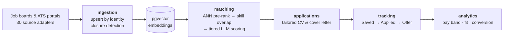

---
hide:
  - navigation
---

<div align="center" markdown>

{ width="320" }

### AI-assisted job hunting — ingest, rank, and apply, end to end.

</div>

HireSense pulls postings from job boards and company ATS portals, ranks them against your
profile with **pgvector semantic search + tiered LLM scoring**, and manages the whole
pipeline: tracking, CV & cover-letter generation, interview prep, outreach, and analytics.


## How it works

1. **Ingest** — adapters pull postings from job boards and company ATS portals; jobs are
   upserted by stable identity and closed automatically when they disappear from the source.
2. **Rank** — a pgvector ANN pre-rank narrows the field, then skill overlap and tiered LLM
   scoring produce an explainable match score per role.
3. **Apply** — track applications end to end: generate tailored CVs and cover letters, prep
   for interviews, run outreach, and review analytics.



## Quick start

You need Docker, and **two** `.env` files — Compose reads the repo-root one for
`${VAR}` interpolation, the app container reads `backend/.env` via `env_file`:

```bash
git clone https://github.com/StevSant/HireSense.git
cd HireSense

cp .env.example .env                  # set POSTGRES_PASSWORD — it has no default
cp backend/.env.example backend/.env  # set AUTH_PASSWORD and JWT_SECRET_KEY

docker compose up --build             # db :5432 · app :8000 · frontend :4200 · Grafana :3000
docker compose exec app uv run python -m alembic upgrade head   # create the schema
```

!!! warning "The shipped placeholders are rejected at startup"

    `POSTGRES_PASSWORD` has no committed default, and the backend refuses to boot while
    `AUTH_PASSWORD` or `JWT_SECRET_KEY` still hold their sample values (`changeme`,
    `change-this-to-a-random-secret`). Generate real ones with
    `python -c "import secrets; print(secrets.token_urlsafe(48))"`.

See the [README](https://github.com/StevSant/HireSense#readme) for the full setup, and
[`backend/ARCHITECTURE.md`](https://github.com/StevSant/HireSense/blob/main/backend/ARCHITECTURE.md)
for the hexagonal, bounded-context backend design.

## Contributing

Issues and PRs are welcome. Start from the
[issue templates](https://github.com/StevSant/HireSense/issues/new/choose) and follow the
Conventional Commits convention (`type(scope): description`).
